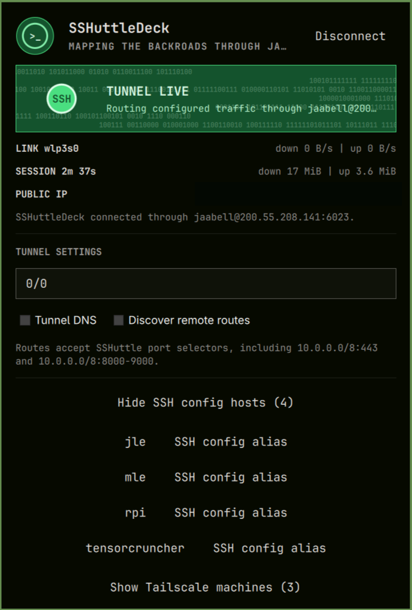

# SSHuttleDeck

<p align="center">
  
</p>

SSHuttleDeck is an Omarchy bar widget that launches SSHuttle SSH VPN tunnels
through SSH config aliases, Tailscale machines, or a custom host/IP and SSH
port.

Keywords: SSHuttle, SSH, VPN, tunnel, Tailscale, routing.



The panel shows SSHuttle's daemon state, primary-link throughput, and the
current public IP address. Link throughput is intentionally labeled as link
traffic: SSHuttle does not expose exact per-tunnel traffic counters. Opening
the panel requests public-IP and ISP information from `ipwho.is`. Its response
is limited to 4 KiB before parsing.

## Requirements

- `sshuttle` on the local machine: `omarchy pkg add sshuttle`
- `curl` for the optional public-IP and ISP display
- SSH access to the selected remote machine
- A Python interpreter on the remote machine
- A one-time graphical authorization to install the root-owned launcher

## Install

```sh
omarchy plugin add https://github.com/jaabell/sshuttledeck.git --enable
```

## Usage

Click `SSH-` in the bar, choose an SSH config alias, Tailscale machine, or
enter a custom endpoint. SSHuttleDeck uses Omarchy's graphical polkit prompt
to grant the local firewall privilege without opening a terminal.

On first use, the panel displays **Security Setup Required**. Click **Install
secure helper**, review the graphical authorization request, and enter an
administrator password. This copies only the release-pinned
`sshuttledeck-root` to `/usr/local/libexec/sshuttledeck-root`; no tunnel starts
during setup.

Authenticate with the selected host in a terminal once before using it here,
so its host key is trusted. SSHuttleDeck uses a private key under `~/.ssh`
with no interactive passphrase; hosts requiring a remote password, agent-only
keys, `ProxyCommand`, or other executable SSH configuration are intentionally
not supported by the privileged launcher.

The route box accepts normal SSHuttle route syntax, including port-specific
routes such as `10.0.0.0/8:443` and `10.0.0.0/8:8000-9000`. Custom SSH ports
from 1 through 65535 are supported. SSH config aliases preserve their own
configured port and identity settings.

Right-click the bar button or use the Disconnect button to stop the current
SSHuttleDeck tunnel.

## Privileged Helper

The panel invokes a root-side verifier, not `install` directly. It opens the
helper with symlink protection, verifies that the opened file is a regular file
owned by the requesting user and not group/world-writable, then stages that
open file descriptor in `/usr/local/libexec`. The staged and installed bytes
must both match the SHA-256 pinned in `privileged-helper.manifest.json`; a
mismatch removes the helper and its root-owned verification marker, then
aborts. The panel requires that marker to match the pinned digest before it
will execute the helper. Repeat the panel setup after an update that changes
`sshuttledeck-root`.

The helper stores its state under `/run/sshuttledeck/<uid>`, never loads user
SSH configuration as root, and accepts only validated hosts, routes, ports,
and private-key paths.

## Remove

Disconnect any active tunnel first. Removing the Omarchy plugin does not remove
the root-owned helper automatically, by design. Remove both explicitly:

```sh
omarchy plugin remove jaabell.sshuttledeck
pkexec rm -f /usr/local/libexec/sshuttledeck-root \
  /usr/local/libexec/sshuttledeck-root.sha256
```

The remaining `/run/sshuttledeck/` state is temporary and disappears on reboot.
